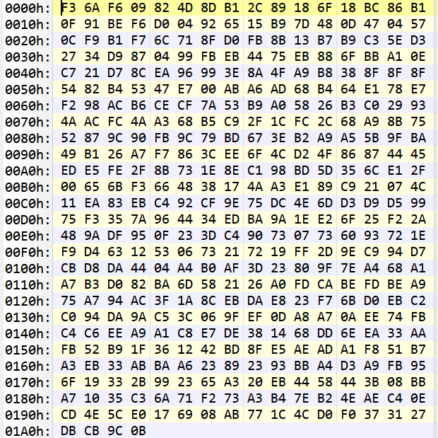

# oneCrypto 密码库设计实验报告

## 实验目的

利用之前实验所实现的代码，设计一个简单可用的面向对象编程思想的密码学库。

## 实验内容

### oneCrypto.common

#### 内容

 常见的数学、编码运算。

- 大整数和字符串的相互转化
- 整数求逆
- 快速模幂
- 扩欧运算
- 中国剩余定理

#### 测试

### oneCrypto.primes

#### 内容

素数和强素数运算。

- Miller-Rabin素性检验
- 强素数检验
- 按比特长度随机获取素数
- 按比特长度随机获取强素数

#### 测试

### oneCrypto.ECC

#### 内容

椭圆曲线运算。

- 基于 ECC 的四则运算
- 椭圆曲线上的加解密算法

#### 测试

见 `oneCrypto.SM2`。

### oneCrypto.SM2

#### 内容

国家标准椭圆曲线公钥加密算法，支持输入检测。

- 加密算法
- 签名算法

#### 测试

### oneCrypto.SM3

#### 内容

国密 SM3 密码杂凑算法。

#### 测试

### oneCrypto.SM4

#### 内容

国家标准分组密码，支持输入检测。

- 基本加解密运算
- PKCS#7 填充模式下的 ECB 工作模式加解密
- PKCS#7 填充模式下的 CBC 工作模式加解密
- OFB、CFB 工作模式加解密
- 以上工作模式的文件加解密

#### 测试

##### test

##### ofb_test

##### de_ofb_test

## 实验总结

因为之前实现各种算法时就特意注意了面向对象和封装性，市面上似乎也并没有公认比较优秀的 python 开源国家标准密码学算法库，于是大作业方案选择了更能利用之前自己封装的代码的密码库设计。

这确实是对于我这个对优化没有兴趣、技术栈积累不够的密码学实验爱好者来说，最合适的结课方式。